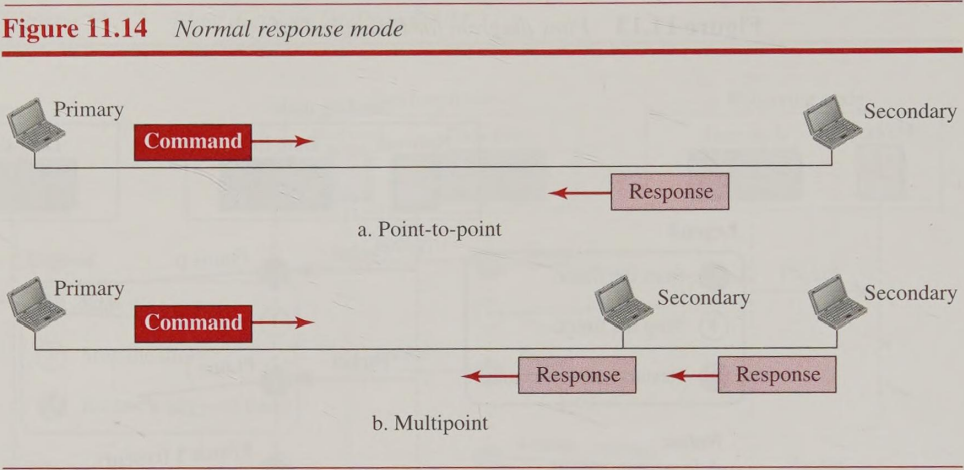

>High-level Data Link Control (HDLC) is a bit-oriented protocol for communication over point-to-point and multipoint links. It implements the Stop-and-Wait protocol.
# Configurations and Transfer Modes

HDLC provides two common transfer modes that can be used in different configurations: normal response mode (**NRM**) and asynchronous balanced mode (**ABM**). 
In normal response mode (NRM), the station configuration is unbalanced. We have one primary station and multiple secondary stations. A primary station can send commands; a secondary station can only respond. 
The NRM is used for both point-to-point and multipoint links.
![[Pasted image 20240909074337.png]]

In ABM, the configuration is balanced. The link is point-to-point, and each station can function as a primary and a secondary (acting as peers).
![[Pasted image 20240909074357.png]]
# Framing

To provide the flexibility necessary to support all the options possible in the modes and configurations just described, 
>HDLC defines three types of frames: **information** frames (I-frames), **supervisory** frames (S-frames), and **unnumbered** frames (U-frames).

Each type of frame serves as an envelope for the transmission of a different type of message. 
* I-frames are used to data-link user data and control information relating to user data (piggybacking). 
* S-frames are used only to transport control information. 
* U-frames are reserved for system management. Information carried by U-frames is intended for managing the link itself.

Each frame in HDLC may contain up to *six* fields, a beginning flag field, an address field, a control field, an information field, a frame check sequence (**FCS**) field, and an ending flag field. In *multiple-frame transmissions*, the ending flag of one frame can serve as the beginning flag of the next frame

![[Pasted image 20240909075010.png]]

>The fields and their use in different frame types
* ***Flag field***. This field contains synchronization pattern 01111110, which identifies both the beginning and the end of a frame.
* ***Address field.*** This field contains the address of the secondary station. If a primary station created the frame, it contains a **to** address. If a secondary station creates the frame, it contains a **from** address. The address field can be one byte or several bytes long, depending on the needs of the network.
* ***Control field.*** The control field is one or two bytes used for flow and error control.
* ***Information field.*** The information field contains the user’s data from the network layer or management information. Its length can vary from one network to another.
* ***FCS field.*** The frame check sequence (FCS) is the HDLC error detection field. It can contain either a 2- or 4-byte CRC.

The control field determines the type of frame and defines its functionality.
![[Pasted image 20240909075536.png]]
### *Control Field for I-Frames*
